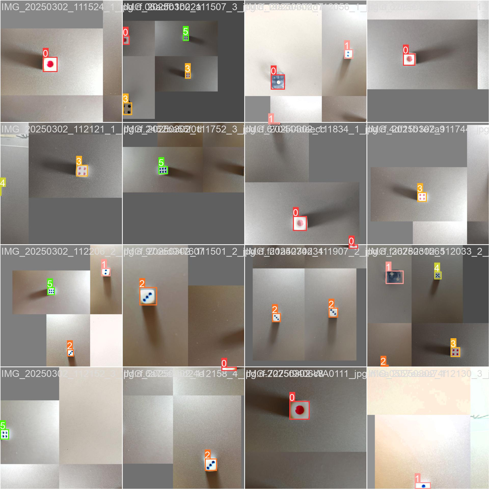
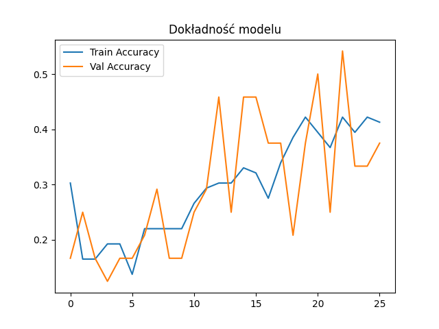

# Dice poker ai

## Jan Gasztold, Uniwersytet Gdański, Wydział Matematyki Fizyki i Informatyki, Informatyka praktyczna rok 2, Data: 11.06.2025

## Spis treści

1. [Spis treści](#spis-treści)
2. [Wprowadzenie](#wprowadzenie)
3. [Etapy realizacji](#etapy-realizacji)
4. [Etap 1 - przygotowanie do projektu](#etap-1---przygotowanie-do-projektu)
5. [Etap 2 - przygotowanie środowiska](#etap-2---przygotowanie-środowiska)
6. [Etap 3 - przemyślenie planu działania](#etap-3---przemyślenie-planu-działania)
7. [Etap 4 - trenowanie rozpoznawania jednej kości](#etap-4---trenowanie-rozpoznawania-jednej-kości)
8. [Etap 5 - trenowanie rozpoznawania lokalizacji kości dzięki yolo](#etap-5---trenowanie-rozpoznawania-lokalizacji-kości-dzięki-yolo)
9. [Etap 6 - trenowanie yolo na Google Colab](#etap-6---trenowanie-yolo-na-google-colab)
10. [Etap 7 - trenowanie rozpoznawania jednej kości na innym datasetcie](#etap-7---trenowanie-rozpoznawania-jednej-kości-na-innym-datasetcie)
11. [Etap 8 - sprawdzanie modelu za pomocą Grad-CAM dodanie OpenCV](#etap-8---sprawdzanie-modelu-za-pomocą-grad-cam-dodanie-opencv)
12. [Etap 9 - stworzenie pierwowzoru aplikacji](#etap-9---stworzenie-pierwowzoru-aplikacji)
13. [Etap 10 - skrypt oceniający kości na ręce](#etap-10---skrypt-oceniający-kości-na-ręce)
14. [Etap 11 - drzewo decyzyjne sprawdzający opłacalność gry](#etap-11---drzewo-decyzyjne-sprawdzający-opłacalność-gry)
15. [Etap 12 - finalizacja aplikacji](#etap-12---finalizacja-aplikacji)
16. [Funkcjonalności](#funkcjonalności)
17. [Problemy i wyzwania](#problemy-i-wyzwania)
18. [Podsumowanie](#podsumowanie)

## Wprowadzenie
### Opis projektu
Projekt "Dice Poker AI" jest inteligentnym systemem wspomagającym grę w kościanego pokera. System wykorzystuje zaawansowane technologie, takie jak uczenie maszynowe, analize obrazu oraz algorytmy decyzyjne, aby rozpoznawać kości na podstawie zdjęć, oceniać strategię gry oraz podejmować decyzje licytacyjne. Projekt łączy różne podejścia, w tym modele oparte na YOLO, Grad-CAM, OpenCV oraz frameworku .keras, aby zapewnić kompleksowe rozwiązanie.

### Cel projektu

Celem projektu jest opracowanie programu zdolnego do:
1. **Klasyfikacji kości do gry** na podstawie obrazu, z wykorzystaniem uczenia maszynowego.
2. **Oceny opłacalności gry**, uwzględniając ryzyko i warunki otoczenia.
3. **Podejmowania decyzji** dotyczących strategii gry, takich jak wybór kości do przerzutu czy podbijanie stawki w licytacji.

## Etapy realizacji
### Etap 1 - przygotowanie do projektu
Prace rozpocząłem od wyboru technologii, w której zrealizuję projekt. Zdecydowałem się na Pythona ze względu na szeroki ekosystem bibliotek oraz moje doświadczenie z tą technologią. Projekt realizowałem w środowisku WSL2 na systemie Windows 11, w wersji Pythona 3.10.12.

### Etap 2 - przygotowanie środowiska
Skorzystałem z ogólnodostępnych datasetów zdjęć kości do gry. Zebrałem około 3000 zdjęć przedstawiających różne układy kostek z różnych perspektyw. Następnie przygotowałem strukturę projektu oraz odpowiednio skonfigurowałem `.gitignore`.

### Etap 3 - przemyślenie planu działania
W pierworodnym planie model miał rozpoznawać z całego zdjęcia jakie kości zostały wyrzucone, jednak w trakcie wykonywania go z każdym krokiem rodziły się nowe problemy. Ciągłe przenoszenie modelu poprzez transfer learning powodował, że model zaczynał się gubić, a ciągłe wykładnicze dokładanie liczby klas nie mogło się powieść przy tak ograniczonym datasetcie.

Po ustaleniu tego czego się nauczyłem i jakie są największe problemy mojego modelu uznałem, że muszę inaczej podejść do aktualnych przeciwności. Największym błędem było staranie się przypisania każdej konfigiracji odpowiedniej klasie - postanowiłem skorzystać z yolo, aby wycięło każdą kość ze zdjęcia po czym inny stworzony do tego model będzie klasyfikował jaka jest to kość.

### Etap 4 - trenowanie rozpoznawania jednej kości
Na początku chciałem skorzystać z prelearningu, ale obecność tła na zdjęciach komplikowała proces uczenia. Dzięki temu, że jeden z moich datasetów był typu PASCAL VOC mogłem przyciąć wszystkie zdjęcia z tego datasetu (około 1200), a następnie uczyć model jaka to jest kość. Okazało się to sukcesem, ponieważ val_acc od 10 epoki oscylowało na poziomie 99-100%. Mimo tak wczesnych świetnych wyników model dalej się uczył i wartość val_loss ciągle spadała. 

Model ten został stworzony na podstawie skryptu trial-5. Wykorzystywał MobileNetV2 z częściowo odblokowanymi warstwami, do których dodana jest warstwa gęsta i dropout, augmentację typu Mixup i CutMix. Pomimo zawartego early stopping model uczył się aż do maksymalnej (100) epoki. Przy tak dobrych wynikach uznałem, że nie są potrzebne kolejne eksperymenty z augmentacją i zachowałem ten model jako najlepszy.

### Etap 5 - trenowanie rozpoznawania lokalizacji kości dzięki yolo
W tym etapie postanowiłem nauczyć model rozpoznawania lokalizacji kości za pomocą yolo. Pobrałem repozytorium yolo oraz utworzyłem parę skryptów, żeby pozwolić i ułatwić sobie pracę z nową biblioteką. Rozpącząłem naukę modelu dla odpowiedniego datasetu. Niestety przez brak karty NVIDIA musiałem korzystać z CPU i doprowadziło to do krytycznej temperatury, więc postanowiłem zakończyć naukę na 31 epoce. Pomimo wczesnego zakończenia rezultaty detekcji były bardzo zadowalające, chociaż zdarzały się błedy - najczęstszym z nich była wielokrotna detekcja jednej kości. 

Model radził sobie bardzo dobrze z innymi datasetami, a także ze zdjęciami wielu kości, chociaż spodziewałem się, że będzie to sprawiać większy problem i mam nadzieję, że następne dotrenowanie nie spowoduje utraty tej umiejętności. Po głębszym zastanowieniu doszedłem do wniosku, że model musi być dotrenowany, ale nie będę tego robić na swoim urządzeniu - skorzystałem z darmowej chmury - postawiłem na Google Colab ze względu na prostą konfigurację.

### Etap 6 - trenowanie yolo na Google Colab
Przejście na Google Colab okazało się świetną opcją - niedość, że trenowanie modelu w ten sposób nie obciążała mojego komputera, to jeszcze trening odbywał się znacznie szybciej. Niestety po zakończeniu się mojego dostępu do GPU cała nauka została utracona, więc musiałem poczekać, aż znowu uzyskam darmowy dostęp do pracy na GPU. Po kilku dniach trenowania modelu z przerwami model został ostatecznie wytrenowany. 

Wyniki były zadowalające: mAP_0.5 (średnia precyzja) na wysokim poziomie (około 98%), mAP_0.5:0.95 (bardziej rygorystyczne mAP_0.5) około 70%, precyzja ponad 95% i recall około 98%. Uznałem, że model yolo jest wytrenowany wystarczająco, ponieważ będzie wykorzystywany tylko do znajdowania obiektów, jednak miałem pewne obawy, ponieważ dataset był dosyć jednolity i bałem się, że przy bardziej wymagających zdjęciach (np. duża odległość kości od aparatu, duży kąt do podłoża) kości będą źle rozpoznawane.

  

### Etap 7 - trenowanie rozpoznawania jednej kości na innym datasetcie
Z gotowym modelem do rozpoznawania kości oraz yolo postanowiłem je przetestować na wstępnej aplikacji. Niestety przy użyciu trochę trudniejszych zdjęć zrobionych przeze mnie model słabo radził sobie z rozpoznawaniem kości wyciętych przez yolo. Z tego powodu postanowiłem rozpocząć trenowanie aktualnego modelu na trochę trudniejszym datasetcie, przerobionym przez mój model yolo.

Po kilku treningach wyniki val_acc były ciągle na poziomie 100%, jednak w rzeczywistym wykorzystaniu modelu jego dokładność była bardzo niska - cały czas rozpoznawał 4 i 6 jako 5. Postanowiłem przefiltrować datasety. Usunąłem obrazy które mogły powodować gorsze wyniki. Oprócz tego okazało się, że było parę błędnych obrazów - niektóre były pustymi zdjęciami, ale było też kilka błędnych kości przypisanych do odpowiedniego labelu. Ponownie nauczyłem model na dwóch skryptach treningowych. Dokładność dalej oscylowała na poziomie 100%, ale w praktyce model wciąż przypisywał 4 i 6 do 5.

  

### Etap 8 - sprawdzanie modelu za pomocą Grad-CAM dodanie OpenCV
Dla sprawdzenia z czego wynika błędne rozpoznawanie kości skorzystałem z Grad-CAM. Okazało się, że model patrzy tylko na część kości - najczęściej na róg. Moim zdaniem model nauczył się z poprzednich datasetów schematu, które oznacza rozpoznanie kości w pewnych miejscach, nie zwracając uwagi na najbardziej szczególny aspekt - oczka po środku. Po sprawdzeniu wielu zdjęć zdałem sobie sprawę, że gdy kości maja 4 lub 6 kości model nie patrzy na środek profilu, co powodowało główny problem błędnego rozpoznawania.

Próbowałem ograniczyć model do bezmyślnego wybierania kości z pięcioma oczkami - usunąłem większość ich zdjęć z datasetu, jednak model wciąż faworyzował tę klasę. Bałem się, że próba naprawy tego błędu będzie jak walka z wiatrakami oraz tego skutkiem ubocznym będzie utrata umiejętności modelu do rozpoznawania 5.

Postanowiłem więc wykorzystać najprostszą metodę - analiza obrazu bez nauki maszynowej. Metoda ta nie była w 100% skuteczna, więc postanowiłem wykorzystać hybrydę modelu .keras i OpenCV, które okazały się bardzo skuteczne. Wykorzystując logikę i rozpoznawanie kości przez obie metody, doszedłem do zadowalającego wyniku 80% dokładności (7 błędów na 35 kości, testy aplikacji były wykonywane już ręcznie).

Dodatkowo podczas tego etapu zauważyłem, że model yolo rozpoznaje tylko górną część kości, a problem z nakładającymi się boxami naprawiłem zwykłym sprawdzeniem punktów bloczków. Dzięki temu mogłem spokojnie przejść do następnego etapu - stworzenie nowego modelu do wygrywania w kościanego pokera.

  

### Etap 9 - stworzenie pierwowzoru aplikacji
Gdy miałem już stworzone modele do rozpoznawania zdjęć postanowiłem napisać szablon aplikacji. Chciałem, żeby to była prosta aplikacja konsolowa, więc nie korzystałem z żadnego frameworka. Do obliczania wyniku wykorzystałem funkcję z dawnego projektu, który miał ten sam temat przewodni. Celem aplikacji była możliwość grania przez jedną osobę z botem, którego miałem zamiar teraz wytrenować.

### Etap 10 - skrypt oceniający kości na ręce
Pierwotnie rozważałem implementację agenta decyzyjnego lub drzewa decyzyjnego służącego do wyboru optymalnego zestawu kości do przerzutu. Ostatecznie jednak zdecydowałem się na opracowanie prostszego w realizacji skryptu analitycznego, działającego w czasie rzeczywistym.

Zaprojektowany algorytm analizuje wszystkie możliwe kombinacje przerzutów, obliczając dla każdej z nich oczekiwaną wartość punktową. Na tej podstawie wybierana jest strategia maksymalizująca średni wynik. Dodatkowo, skrypt uwzględnia analizę ryzyka poprzez ocenę minimalnego wyniku, jaki można uzyskać z ustalonym prawdopodobieństwem (trafienie co najmniej jednej konkretnej wartości). 

Takie podejście umożliwia porównanie wariantów ryzykownych – nastawionych na maksymalizację punktów – z bardziej zachowawczymi strategiami minimalizującymi ryzyko niepowodzenia.
Dodatkowo sprawdziłem działanie algorytmu - przy pierwszym rzucie wszystkimi kośćmi średni wynik wynosił 9.55, a przy kolejnym rzucie przez AI wynosił 12 punktów. Uważam, że to dobry wynik zwracając uwagę na losowość gry. 

### Etap 11 - drzewo decyzyjne sprawdzający opłacalność gry
Stworzyłem prosty klasyfikator decyzyjny, mający na celu ocenę, czy agent powinien podbić stawkę w danej rundzie gry. Dane treningowe wygenerowano syntetycznie poprzez parowanie istniejących przykładów i losowanie dodatkowych parametrów, takich jak aktualna pula pieniędzy oraz szacowana maksymalna punktacja. Model oparto na drzewie decyzyjnym, uczonym na pięciu cechach: zasobach finansowych obu graczy, aktualnej stawce oraz przewidywanych wynikach punktowych. Uzyskano dokładność klasyfikacji na poziomie 100% dla zbioru treningowego oraz 94% dla testowego. Model pozwala wizualnie interpretować decyzje agenta oraz analizować wpływ poszczególnych cech na jego strategię licytacyjną.

  

### Etap 12 - finalizacja aplikacji
Ostatnim etapem było dokończenie aplikacji. Dodałem algorytmy i modele oraz usprawniłem całą strukturę. Testując aplikację wszystkie modele osiągały bardzo dobre wyniki co uznałem za sukces aplikacji.

## Funkcjonalności

1. **Rozpoznawanie kości**:
   - Model klasyfikuje kości na podstawie obrazu, wykorzystując hybrydę metod opartych na uczeniu maszynowym (.keras) oraz analizie obrazu (OpenCV).
   - Dokładność rozpoznawania wynosi około 80% w testach aplikacji.

2. **Lokalizacja kości**:
   - Model YOLO identyfikuje położenie kości na zdjęciach, osiągając wysoką precyzję (mAP_0.5: 98%).

3. **Ocena strategii gry**:
   - Skrypt analityczny ocenia optymalny zestaw kości do przerzutu, uwzględniając ryzyko i maksymalizację punktów.

4. **Decyzje licytacyjne**:
   - Drzewo decyzyjne ocenia opłacalność podbijania stawki w grze, wizualizując wpływ poszczególnych cech na decyzje.

5. **Aplikacja konsolowa**:
   - Umożliwia grę z botem, który podejmuje decyzje na podstawie wytrenowanych modeli.

6. **Grad-CAM**:
   - Narzędzie do analizy błędów modelu, pozwalające zrozumieć, które części obrazu są kluczowe dla decyzji modelu.

| Funkcja              | Model                 | Dokładność    |
| -------------------- | --------------------- | ------------- |
| Rozpoznawanie kości  | MobileNetV2 + OpenCV  | \~80%         |
| Lokalizacja          | YOLOv5                | mAP\_0.5: 98% |
| Decyzja o przerzucie | Algorytm heurystyczny | EV: +2.45 pkt |
| Decyzje licytacyjne  | Drzewo decyzyjne      | 94% test acc  |

## Problemy i wyzwania
### Usunięty zapis modelu
Podczas pracy z repozytorium Git doszło do przypadkowego usunięcia zapisanych modeli z etapów 3 i 4, co uniemożliwiło ich ponowne wykorzystanie. Rozpocząłem trenowanie nowego modelu na tych samych etykietach i pierwszy wynik był słabszy aż o około 30% - dokładność spadła o 4%. Mimo chęci przejścia do następnego etapu z gorszym wynikiem, zdecydowałem się ponownie wytrenować model na najlepszych dostępnych wcześniej etykietach. To okazało się sukcesem - prawdopodobnie wcześniej skorzystałem ze złego skryptu i wynik nowego modelu nie tylko nie był gorszy, ale też lepszy o 4% względem poprzedniego. Można zatem powiedzieć, że nie ma tego złego co na dobre nie wyszło.

### Problem 5 oczek
Pomimo tego, że model osiągnął 100% val_accuracy i świetnie sobie radził na danych treningowych to rzeczywiste rozpoznawanie kości było bardzo słabe. Wszystkie kości z 4 i 6 oczkami uznawał za kości z 5 oczkami, przez co rzeczywista dokładność nie mogła przerosnąć 67%. Prawdopodobnym problemem było wyuczenie się modelu zwracania uwagi na niedecydujące elementy, a także zbyt mały dataset. Po wielu próbach i zmianach problem ten nie został rozwiązany tylko bardziej ominięty - wykorzystując metodę analizy obrazu powstała hybryda do wspólnego rozpoznawania kości z częściowo działającym modelem .keras.

## Podsumowanie
Projekt "Dice Poker AI" zrealizował założone cele, tworząc aplikację zdolną do rozpoznawania kości, oceny strategii gry oraz podejmowania decyzji licytacyjnych. Pomimo napotkanych problemów, takich jak błędne rozpoznawanie kości z 4 i 6 oczkami, udało się osiągnąć zadowalające wyniki dzięki zastosowaniu hybrydowych metod oraz analizy obrazu.

Największym sukcesem projektu jest stworzenie kompleksowego systemu, który łączy różne technologie, takie jak YOLO, Grad-CAM, OpenCV oraz modele oparte na .keras. Aplikacja konsolowa pozwala na interakcję z botem, co stanowi praktyczne zastosowanie opracowanych modeli.

Na całe środowisko składa się 57 folderów i 416 plików w tym: 75 plików pythonowych, 150 obrazów, 67 zapisanych modeli .keras i 112 plików .json. Podczas pracy nad projektem nauczyłem się wielu rzeczy, skorzystałem z wiedzy którą posiadłem na zajęciach, ale także wykorzystałem rzeczy których nie było. Pisanie i eksperymentowanie z róznymi modelami sprawiało mi dużą przyjemność. Nauczyłem się także, że lepiej wcześniej zorganizować cały plan projektowy, ponieważ często działanie "na żywioł" skutkuje potrzebą cofnięcia się o wiele kroków do tyłu.
